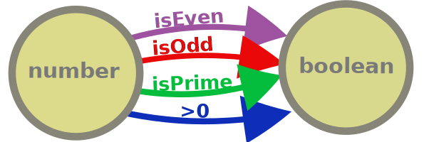

Some other categories
===

Every category theory guide (including mine) starts by talking about set theory. However, looking back, I really don't know why that is the case - most other books that focus around a specific subject don't start by introducing an entirely different subject. Perhaps the set-first approach is the best way to introduce people to categories, or perhaps that is just one of the things that people just do, simply because everyone else does it. But one thing is for sure - we don't need to study sets in order to understand categories. So in this chapter I would like to start over and talk about categories as a first concept. 

Pretend like it's a new book:

Starting over with categories
===

So, a category is a collection of objects (things) where the "things" can be anything you want. Consider, for example, these ~~colourful~~ grey balls:

A category consists of a collection of objects as well as some arrows connecting some of them to one another, that we call (the arrows) morphisms.

Wait a minute - we said that all sets form a category, but at the same time any one set can be seen as a category on its own right (just one which has no morphisms). This is an example of a phenomenon that is very characteristic of category theory - one structure can be examined in many different ways and play many different roles, often in a recursive fashion.

This particular analogy (a set as a category with no morphisms) is, however, not very useful - category theory is *all about the morphisms*. If in set theory, arrows are nothing but a connection between a source and a destination, in category theory it's the *objects* that are nothing but a source and destination for the arrows that connect them to other objects. This is why in this chapter the arrows, and not the objects, are coloured - the category of sets should really be called the category of set functions.

Speaking of which, note that objects in a category can be connected by multiple arrows and that arrows having the same domain and codomain does not in any way make them equivalent.

Why is that is pretty obvious if we go back to set theory for a second (maybe we really have to do this from time to time) - there are, for example, an infinite number of functions that go from number to boolean and the fact that they have the same signature does in no way make them equivalent to one another.

Composition
---

One of the few, or maybe even the only, requirement for a structure to be called a category is that two morphisms can make a third, or in other words that morphisms are *composable*. In practice this means that given two successive arrows, we can draw a third one that is equivalent to the consecutive application of the other two.

Again, note that this criteria is not met by just *any* morphism with this type signature. There is *exactly one* morphism that fits these criteria and there may be some which don't.

Commuting diagrams
---

The diagram above, uses colors to illustrate the fact that the third morphism is equivalent to the other two (and not just some unrelated morphism), but in practice this notation is a little redundant - the only reason to draw diagrams with arrows in the first place is represent paths between objects that are equivalent to each other, all other paths should just go in different diagrams. So let's drop the colors:

Diagrams that are like that (ones in which any two paths between two objects are equivalent to one another) are called commutative diagrams (or diagrams that commute). All diagrams that we have here (except the wrong ones) commute.

Identity
---

In order to be able to define more stuff using morphisms, we define what we call the "identity morphism" for each object. In short, this is a morphism, that doesn't do anything to the object.

It's important to mark this morphism, because there can be (let's add the very important (and also very boring) reminder) many morphisms from one object to the same object, that actually do stuff. For example mathematics deals with a multitude of functions that have the set of numbers as domain and codomain (e.g. negate, square, add one etc.) and are not at all the identity morphism.

**Question:** What is the identity morphism in the category of sets?

Isomorphisms
---

The concept of identity morphism, provides us with a category-theoretic definition of an isomoprhism. We can say that an isomorphism between two objects (**A** and **B**) consists of two functions - (**A → B**.  and **B → A**) such that their composition is equivalent to the identity function. Or alternatively we can express that by the following commuting diagram.

What the diagram expresses is that going from the one object to the other one and then back again is the same as applying the identity morphism i.e. doing nothing. 

