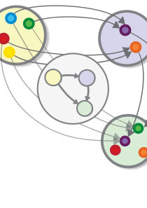

Category Theory Illustrated is a primer in category theory and various related concepts in "higher" mathematics that is *really* accessible to people with no prior exposure to the subject without being dumbed down, by utilizing visual explanations.

The book serves as chapter 0 going through the gist of the material covered by other similar introductory books, but doing so in a way that would enable non-mathematicians to swift through with ease.

Reading it would enable my readers to effortlessly go through any academic introduction to category theory, as well as to start tackling resources that use category theory as a tool to treat other subjects.

> "The range of applications for category theory is immense, and visually conveying meaning through illustration is an indispensable skill for organizational and technical work. Unfortunately, the foundations of category theory, despite much of their utility and simplicity being on par with Venn Diagrams, are locked behind resources that assume far too much academic background.
>
>Should category theory be considered for this academic purpose or any work wherein clear thinking and explanations are valued, beginner-appropriate resources are essential. There is no book on category theory that makes its abstractions so tangible as "Category Theory Illustrated" does. I recommend it for programmers, managers, organizers, designers, or anyone else who values the structure and clarity of information, processes, and relationships."

[Evan Burchard](https://www.oreilly.com/pub/au/7124), Author of "The Web Game Developer's Cookbook" and "Refactoring JavaScript"

> "The clarity, consistency and elegance of diagrams in 'Category Theory Illustrated' has helped us demystify and explain in simple terms a topic often feared."

[Gonzalo Casas](https://gnz.io/), Software developer and lecturer for Introduction to Computational Methods for Digital Fabrication in Architecture at ETH Zurich
